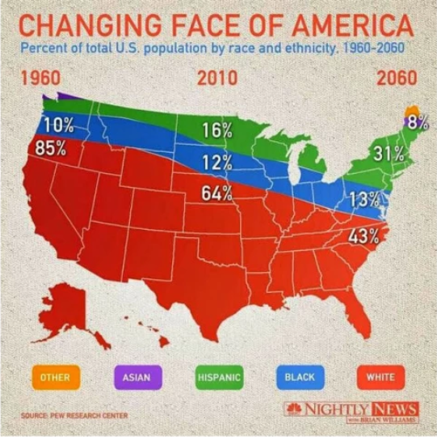
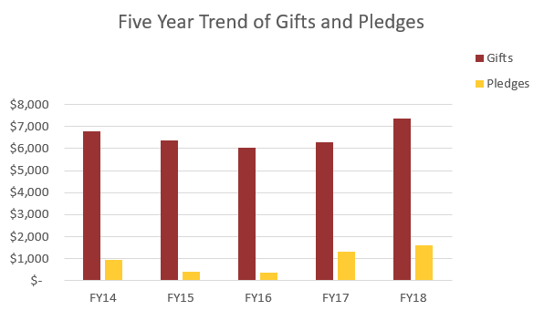

### Assignment 1 Description:

#### Find 1 good and 1 bad visual. Explain in detail each visualization in a markdown file. The 1st paragraph should tell the story behind the picture. The 2nd paragraph should critique the visualization, or explain why it is a good visualization. Make sure to explain what you think the author is trying to convey and what the reader might think when they see it. Once complete, upload to github.

## Bad Visual:

The bad visualization that I chose is sourced from the Pew Research
Center, and was presented on the Nightly News in 2014. The author is
trying to convey the percent of total U.S. population by race and
ethnicity from 1960 - 2060. They are attempting to show a projected
distribution of how race and ethnicty in the United States will change
over the years. I assume they wanted to “jazz” the information up by
overlaying the original version of the data onto a shape of the United
States, since the original graphic was just a simple rectangle graph.

This infographic causes many problems for viewers, especially those who
don’t fully understand graphs and charts. By overlaying the original
image onto a shape of the United States, it displays to readers that
those specific races live in those designated states only. For example,
viewers would think that New York State is only comprised up of the
Hispanic population. Another problem is that underneath the years 1960,
2010, and 2060 are percentages of the population associated by each
race. The problem here is that when adding up each individual years
statistics, none add up to 100%. For example, the graphic is saying that
in 1960 the United States is comprised of an 85% White, and 10% Black
population. There are no other statistics clearly showing how much the
Hispanic and Asain populations made up, and the chart doesn’t even show
the “Other” option during this time period. Once the view has to infer
statistics like this, major problems can occur.

## Good Visual:

The good visualization that I chose was one I created during a project
for my department two years ago. I was asked to do an analysis of giving
history to the College within a five year trend and show if it is
increasing or decreasing. The time period for the College’s Fiscal Year
is June 1 to May 31, so for example FY18 is June 1, 2017 to May 31,
2018.

Looking at the chart, I believe that it conveys the essential parts of
the trend. It’s clear that there is a dip in FY16 but, overall FY18 is
the highest when it comes to both gifts and pledges. I believe that
someone can look at this visual and clearly see the trend over the five
year span. The only critique would be to add call outs for the amounts
on each bar since the gift range on the left hand side is so large it’s
hard to really see how much each amount was during that fiscal year. I
believe the legend is necessary to see which bars are gifts and which
are pledges. I also liked the fact that I used colors that match SJFC,
for aesthetic purposes.
